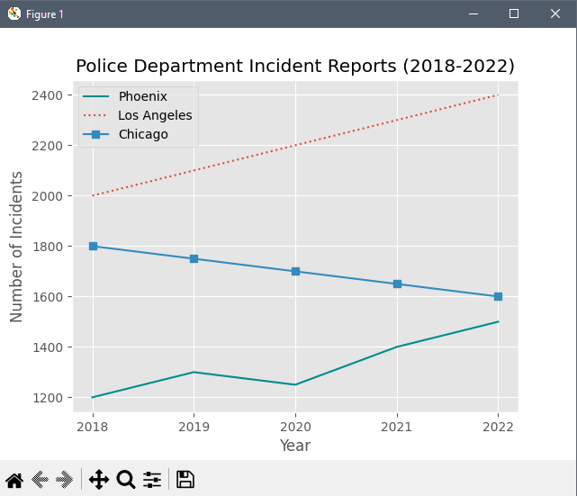
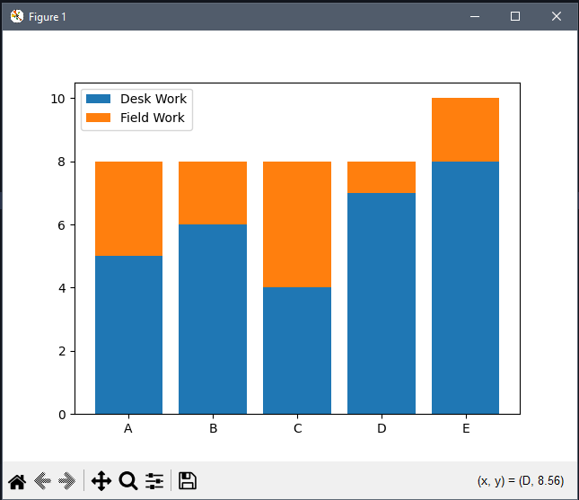
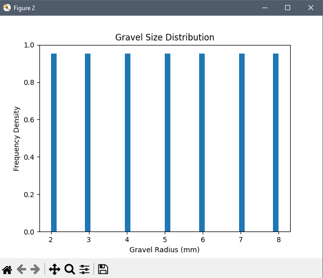

## 📊 Matplotlib

**Matplotlib** adalah library Python yang digunakan untuk memvisualisasikan data ke dalam berbagai bentuk grafik.

### Fungsi Gaya Grafik

- `plt.plot()`  
  Membuat **grafik garis** (line chart)

  

- `plt.bar()`  
  Membuat **grafik batang** (bar chart)

  

- `plt.scatter()`  
  Membuat **grafik titik** (scatter plot)

  

- `plt.hist()`  
  Membuat **grafik histogram**

  
